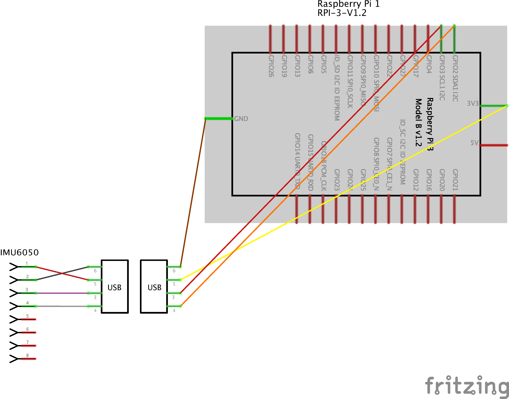

## Hardware Prerequesites
Prerequesite is that the sensor is connected to the Raspberry Pi's GPIO pins. The following circuit diagram shows how the physical connection between sensor and Raspberry Pi must be established (The USB Connector is not important - I installed it to be able to detach the sensor from the Raspberry Pi in a simple way).

## Installation guide for the Raspberry Pi (GesBerry_Pi folder)
1. Download and install Raspian (see https://www.raspberrypi.org/downloads/)
2. Connect Mouse and Keyboard to the Raspberry Pi and start the Raspberry Pi Config Menu (https://www.raspberrypi.org/documentation/configuration/raspi-config.md)
3. Enter in sub menu "Interfacing Options" and enable the SSH and the I2C 
4. Change RaspberryPi default password to a password of your choice. 
5. open Terminal on the Raspberry Pi and enter the following lines (this updates the Raspberry Pi):
	1. `sudo apt-get update`
	2. `sudo apt-get upgrade`
6. Install python packages (needed for script-execution) - enter in the RaspBerry Pi Terminal:
	1. Install Numpy: `pip3 install numpy`
	2. Install Atlas: `sudo apt-get install libatlas-base-dev`
	2. Install SciPy: `sudo apt-get install python3-scipy`
	3. Install Scikit-Learn: `pip3 install -U scikit-learn`
	4. Install Pandas: `pip3 install pandas`
	5. Install libgtkmm-3.0-dev: `sudo apt-get install libgtkmm-3.0-dev`
7. Download the current GesBerry_Pi Code: Open Terminal on the Raspberry Pi and enter:
`git clone https://github.com/MaxLell/Gesberry-Control.git` The Code is downloaded to /home/pi directory
8. Navigate to the Raspberry-Pi-driver folder by entering `cd /home/pi/Gesberry-Control/GesBerry_Pi/Raspberry_pi_IMU6050_driver`
9. enter in Raspberry Pi Terminal: `make -j4` (compiles the IMU-sensor driver)
10. enter in Raspberry Pi Terminal: `pinout` (displays the GPIO Pin Layout)
11. Connect IMU6050 to the concerning Pins

## Usage
First 10 samples/gesture must be recorded. This dataset is used to train the MachineLearning classifier. Afterwards new samples can be detected.

1. __learn gestures__: open Terminal, navigate to the `/GesBerry_Pi` folder and start the training procedure for the Gesture recognition system by entering `python3 GCI_train.py`. The script guides through the process. You can either create your own new gestures or you can use the ones that are provided (see `/GesBerry_MachineLearning/img/gestureTable_1.png`). The GesBerry_MachineLearning folder contains valuable information about the gesture recording process and how to achieve high accuracies.

2. __detect gestures__: open Terminal, navigate to the `/GesBerry_Pi` folder and start the training procedure for the Gesture recognition system by entering `python3 GCI_classify.py`. The script guides through the process. 
