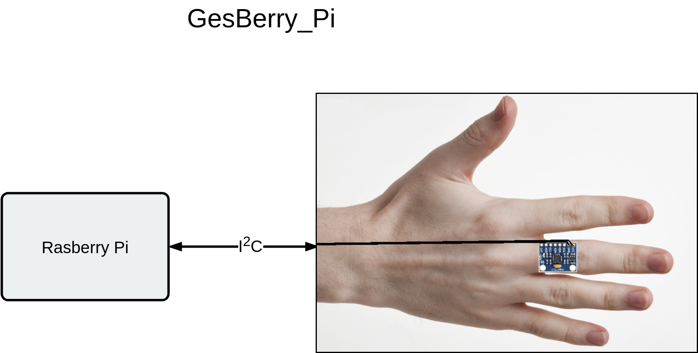

# Gesberry-Control

## Overview

This package contains Gesture-recognition-system based on an IMU6050 (Inertial Measurement Unit), a Raspberry Pi and Machine Learning. The trained system works in the following way:
1. press trigger button
2. sensor records its data output as a time-progression signal for a fixed amount of time and transfers it to the Raspberry Pi
3. The Raspberry Pi interprets the signal via Machine Learning and puts out its estimation.

The following graph shows the system setup:

The sensor is mounted on the backside of the middlefinger (see figure). The major processing unit is the Raspberry Pi. It executes:
- sensor driver
- data-processing
- Machine-Learning (learning from data and classifying new samples)
Finally the gestures are output via the console.

First the software needs to learn the gesture movements. To do so a human operator must train the system with his / her gestures. The system needs to be trained with at least 10 gestures. A trained operator achieves a 10-fold-cross-validation accuracy-score of 97%.

This package is separated into two folders: 
1. The __GesBerry_Pi Package__: This package contains the complete sourcecode to run the Gesture recognition software on a Raspberry Pi. Furthermore a complete installation guide is provided and a circuit diagram is included on how to physically set up the system.

2. The __GesBerry_MachineLearning Package__: This package contains executable jupyter notebooks, which contain several system experiments. `GesBerry_Machine_Learning.ipynb` shows the current system capabilities in terms of detection accuracy (also for future systems) and on the other hand it provides valueable information to maximize the detection accuracy. Here the impact of the human operator is shown. The `GesBerry_CheckGestures.ipynb` script can be used for testing own gesture sets.

## Dependencies and Installation Guides

The installation guides and the dependencies for the concerning packages are included in the folders. Besides the software implentation also a circuit diagram for the hardware development is provided.

Acknowledgements
==========
The whole project was developed in a Masterthesis of Maximilian Lell at the University of Innsbruck.
This research was conducted with the help of Univ.-Prof. Dr.-Ing. Thomas Ussmueller (University Innsbruck) and Dr. Gernot Groemer (Austrian Space Forum). 
The sensor driver for the Raspberry Pi was developped by Jeff Rowberg https://github.com/jrowberg/i2cdevlib and Richard Ghirst https://github.com/richardghirst/PiBits/tree/master/MPU6050-Pi-Demo. The sensor driver is modified to write the sensor's output into a fifo-pipe.
